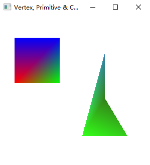
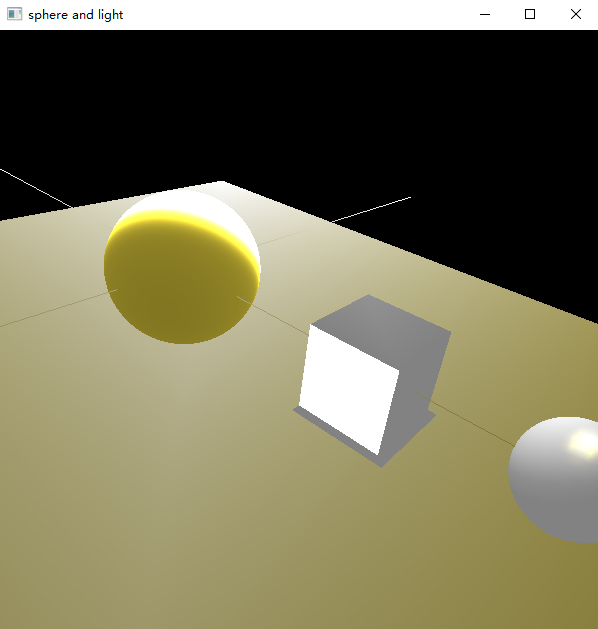
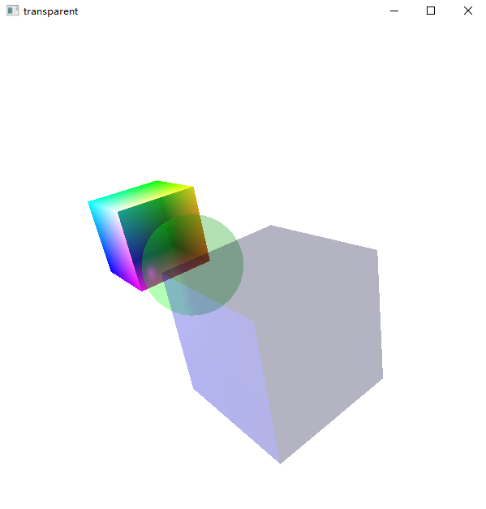
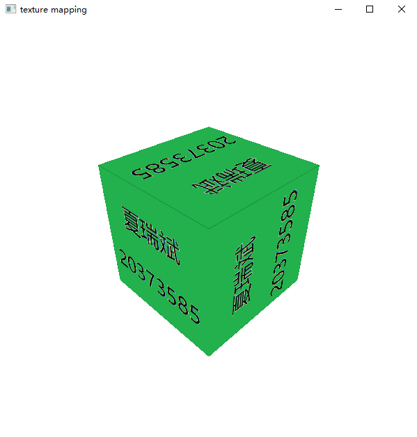

# OpenGL-Demo

> task x 的标号是个人为了方便而标，实际未分任务号

### 关于如何运行本作业

本人用了Visual Studio 2022来完成本次任务（初次使用，还是喜欢vsc啊，但那样都得自己配置，也麻烦）；也用它自动生成git库并推导github上，所以相关sln在vs中打开应该就能直接运行了

`#include <opengl/freeglut.h>` 关于这个头文件，好像是我在调弄OpenGL时，根据网上指示将相关需求库加到vs一个环境的目录下的，网上其他OpenGL的程序在这里总会有各种不同，但反正只要保证能用freeglut.h，这里随意调整就好。

由于vs是整个项目一起编译的，所以对于我这个单文件编译的多程序，运行一个时请设置其他每一个文件的Property->General->Exclude From Build为Yes

### Task 0 绘制试验

古早之前的小试验，“03-基本图形学实验”ppt任务，不过似乎无需提交



这还是不是个凸四边形，所以也有折起感

### Task1 旋转

对应“04-几何对象与变换”ppt的指定任务，源文件为`task1-rotate.cpp`


立方体其实由6个正方形面组成，所以手动画立方体则需要依次画6个正方形面，而用`glBegin(GL_QUADS)`画立方体还需4个顶点，总共要重复24次。不如将相关顶点和绘制顺序实现存入数组，利用for循环调用。之后的任务中如个人画立方体均采用这种方式。然而要求顶底面不填充，则特定轮次的循环时不进行绘制即可。

需要打开深度缓存以展现面的前后关系，这些在之后的课程中有讲到。

关于旋转，设置一个timer，间隔时间回调，每次调用增加旋转角度，满360度则清空重来（不能用%因为GLfloat不支持）；而在display中，需进行绕某轴旋转的矩阵变换，根据课程描述为先平移再旋转再平移回来。

### Task2 模视变换/投影

对应”05-观察与投影”ppt指定任务，其实其他每次任务都有用到，不过这里也单独给出一次演示，源文件为`task2-projection.cpp`


### Task3 球面+光照+阴影

对应”06-光照和明暗绘制”ppt指定任务，源文件为`task3-sphere.cpp`



左上球体为递归细分正四面体得来，对每个三角形面进行细分，等分成4个小等边，然后对新分出的顶点进行归一化，将其到原点的距离化为球半径。递归深度`DEPTH`可调节，一般到8级以上将几乎看不出细分的棱角。（打开光照后都不明显了，可以关闭光照，或使用颜色追踪材质）

加上了两条坐标线来表示立方体和球体中心的对齐关系，图中立方体出由于光影关系线少了一段（其实再刚打开的时候看得见，再点一下屏幕就会打光，有点怪异）

开启了零号和一号光照，为了更好的显示将全局的背景颜色调黑；设置材质参数，参考了网上给的亮金的材质

阴影效果采用了ppt上的方法，先画立方体，然后利用阴影的投影变换矩阵将立方体投影成阴影再绘制上去。这里为立方体添加了法线。

### Task4 半透明效果

对应”08-光栅化与片元融合”ppt指定任务，源文件为`task4-transparent.cpp`



操作比较简单，仅需开启混合模式，指定片元混合所需回调函数；然后rgba上色时，a给小于1的值即可。

```cpp
glBlendFunc(GL_SRC_ALPHA, GL_ONE_MINUS_SRC_ALPHA); //指定混合函数
glEnable(GL_BLEND);	//开启混合模式
```

任务中将自己绘制的立方体朝镜头的这一面，球体和立方体调成了半透明，并改变视角，使其可以展现多物体重叠时的混合效果。

### Task5 纹理映射

对应”09-片元着色”ppt指定任务前两项，源文件为`task5-texture.cpp`



为了将准备的bmp文件加载进OpenGL中，用到了CBMPLoader的工具，从github上别人的项目中搞来，然后稍微调整了一些地方以适配自己的开发环境。事先加载纹理的内容包装在了`loadTexture`中

贴图文件在同目录下

### Task6 环境映射

对应”09-片元着色”ppt指定任务第三项，源文件为`task6-envmap.cpp`


参照课程ppt中给出的代码思路，更换成了之前自己调好的模视变换矩阵和投影矩阵。环境贴图其实就是，在display中先画一遍环境，然而使用`glCopyTexImage2D`将当前场景的内容作为纹理贴图，然后加上目标物体再画一遍，便可应用上该纹理效果，即环境的投影。

画出坐标轴是方便定位，立方体延用之前的画法，这些投影在了球体上。


### 学习杂记

一些函数：

```c++
glViewport();
gluPerspective();
glOrtho();

// 用glut绘图
glutSolidTeapot();

glTexGeni();	// 纹理坐标自动生成, 我都用了glTexCoord..了 

// display前基操
glClearColor(1.0, 1.0, 1.0, 1.0);
glClear(GL_COLOR_BUFFER_BIT | GL_DEPTH_BUFFER_BIT);
glEnable(GL_DEPTH_TEST);
glDepthFunc(GL_LEQUAL);	// GL_LESS	深度检测函数，分别时LESS和LESS+EQUAL的含义
```

其实好像一般OpenGL程序都会有个init函数，不过我之前都分别命名了，就不改过来了

开启深度测试，实现遮挡关系

可以关闭lighting然后画一些东西，再打开lighting；


