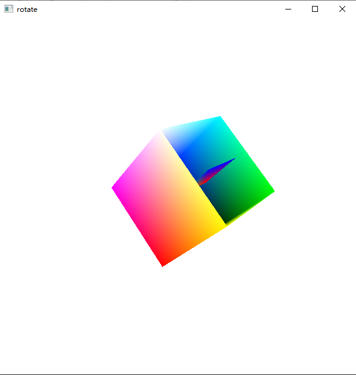
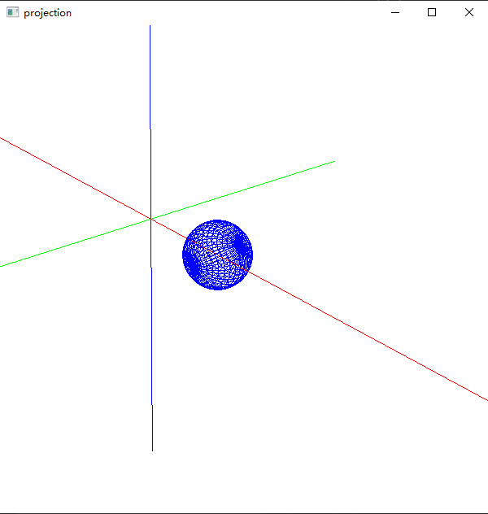
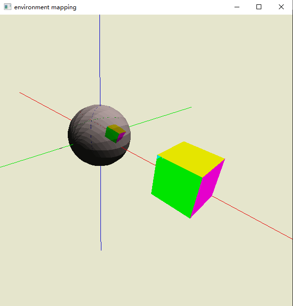

# OpenGL-Demo

> task x 的标号是个人为了方便而标，实际未分任务号

### 关于如何运行本作业


### Task 0 绘制试验

### Task1 旋转

对应“04-几何对象与变换”ppt的指定任务，源文件为`task1-rotate.cpp`



立方体其实由6个正方形面组成，所以手动画立方体则需要依次画6个正方形面，而用`glBegin(GL_QUADS)`画立方体还需4个顶点，总共要重复24次。不如将相关顶点和绘制顺序实现存入数组，利用for循环调用。之后的任务中如个人画立方体均采用这种方式。然而要求顶底面不填充，则特定轮次的循环时不进行绘制即可。

需要打开深度缓存以展现面的前后关系，这些在之后的课程中有讲到。

关于旋转，设置一个timer，间隔时间回调，每次调用增加旋转角度，满360度则清空重来（不能用%因为GLfloat不支持）；而在display中，需进行绕某轴旋转的矩阵变换，根据课程描述为先平移再旋转再平移回来。

### Task2 模视变换/投影

对应”05-观察与投影”ppt指定任务，其实其他每次任务都有用到，不过这里也单独给出一次演示，源文件为`task2-projection.cpp`



### Task3 球面+光照+阴影


### Task6 环境映射

对应”09-片元着色”ppt指定任务第三项，源文件为`task6-envmap.cpp`



参照课程ppt中给出的代码思路，更换成了之前自己调好的模视变换矩阵和投影矩阵。环境贴图其实就是，在display中先画一遍环境，然而使用`glCopyTexImage2D`将当前场景的内容作为纹理贴图，然后加上目标物体再画一遍，便可应用上该纹理效果，即环境的投影。

画出坐标轴是方便定位，立方体延用之前的画法，这些投影在了球体上。


### 学习杂记

一些函数：

```c++
glViewport();
gluPerspective();
glOrtho();

// 用glut绘图
glutSolidTeapot();

glTexGeni();	// 纹理坐标自动生成, 我都用了glTexCoord..了 

// display前基操
glClearColor(1.0, 1.0, 1.0, 1.0);
glClear(GL_COLOR_BUFFER_BIT | GL_DEPTH_BUFFER_BIT);
glEnable(GL_DEPTH_TEST);
glDepthFunc(GL_LEQUAL);	// GL_LESS	深度检测函数，分别时LESS和LESS+EQUAL的含义
```

其实好像一般OpenGL程序都会有个init函数，不过我之前都分别命名了，就不改过来了

开启深度测试，实现遮挡关系

可以关闭lighting然后画一些东西，再打开lighting；


